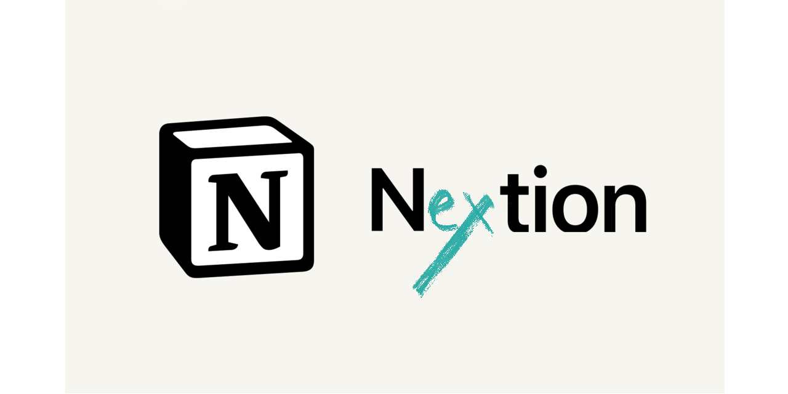
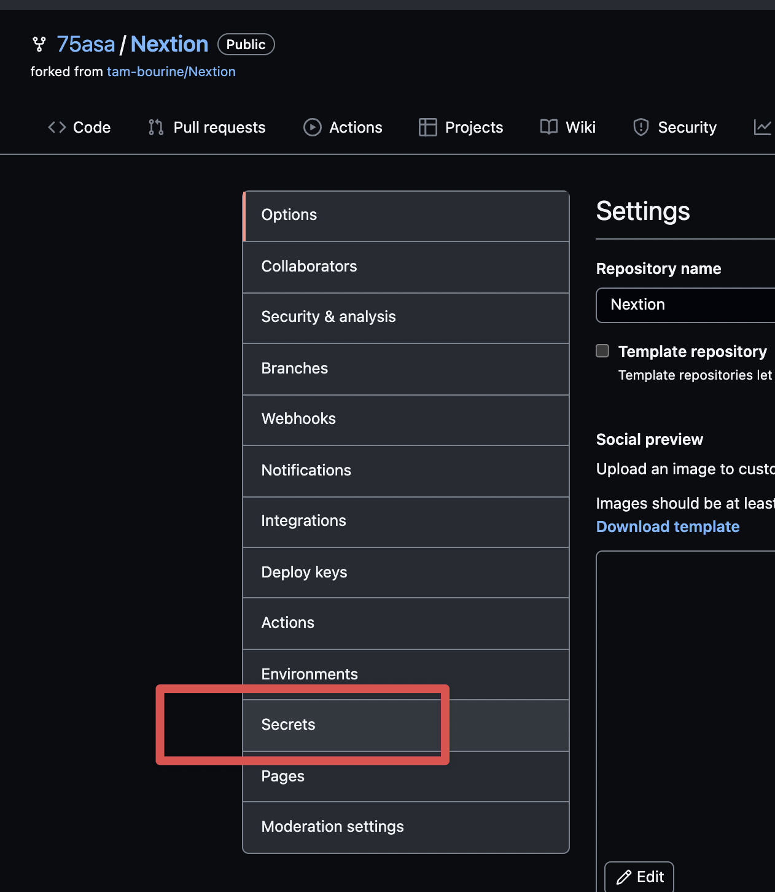

# Nextion

This is a Notion Integration to pick a next page at random for a Notion Database.

[README: JP 🇯🇵](docs/README_JP.md)

# How to use

1. Create a Notion integration and get its API key at [Notion Developers](https://developers.notion.com/), then share your database with the integration.
1. Set the environment variables (see below) for local or GitHub Actions use.
1. Confirm your Notion database properties. By default, the property names are `Name` (title), `Status` (select) and `Assign` (person). You can change them with environment variables.
1. Confirm the cron schedules in `.github/workflows/{chooseNext,watchDone,fetchIcon}.yaml` (times are UTC):
    - chooseNext: `30 1 * * 1` (every Monday 10:30 JST)
    - watchDone: `*/10 * * * *`
    - fetchIcon: `*/10 * * * *`

    The schedules are currently commented out (paused, see #65). Each workflow can also be run manually from the Actions tab (`workflow_dispatch`).

## Requirements

- Node.js 24 (see `.nvmrc`)
- pnpm (the version is pinned in the `packageManager` field of `package.json`; run `corepack enable` or install pnpm yourself)

## Environment variables

| Name | Required | Default | Description |
|---|---|---|---|
| `NOTION_KEY` | ✅ | | Notion integration API key |
| `NOTION_DATABASE_ID` | ✅ | | Target database ID |
| `NOTION_DATA_SOURCE_ID` | | | Data source ID. Only needed when the database has multiple data sources (Notion API 2025-09-03+) |
| `NOTION_NAME_PROP` | | `Name` | Title property name |
| `NOTION_STATUS_PROP` | | `Status` | Select property name for the status (`Next` / `Done` / `NoTarget` / empty) |
| `NOTION_ASSIGN_PROP` | | `Assign` | Person property name |
| `NOTION_NO_IMAGE_URL` | | [NO_IMAGE.png](docs/images/NO_IMAGE.png) | Cover image used when the assignee has no avatar |

### When using on Local

1. `cp .env.example .env` and fill in the values.
1. `pnpm install`
1. Run one of the modes:
    - `pnpm dev:chooseNext` / `pnpm dev:watchDone` / `pnpm dev:fetchIcon` (run TypeScript directly with tsx)
    - or `pnpm build` then `pnpm start:chooseNext` etc.

### When using on GitHub Actions

1. Fork this repository (highly recommended) or clone it.
1. Go to your repository's Secrets settings and add `NOTION_KEY` and `NOTION_DATABASE_ID`.
1. (Optional) To override the property names or the no-image URL, add the optional variables above as Secrets with the same names. They are passed to every workflow; unset ones fall back to the defaults.

FYI: [Using secrets in GitHub Actions](https://docs.github.com/en/actions/security-for-github-actions/security-guides/using-secrets-in-github-actions)

Note: GitHub automatically disables scheduled workflows after 60 days of repository inactivity. Re-enable them from the Actions tab if needed.

# Development

| Command | Description |
|---|---|
| `pnpm lint` / `pnpm lint:fix` | Lint & format check with Biome (`:fix` applies safe fixes) |
| `pnpm typecheck` | Type check with TypeScript |
| `pnpm test` | Run tests with Vitest |
| `pnpm build` | Build to `dist/` |

# Notes

## Spec

### Choose Next

1. Get all pages from the database.
1. Group them by status.
1. If no page has an empty Status, do nothing.
1. Randomly select one of the pages with an empty Status and set its status to `Next`.

### Watch Done

1. Get all pages from the database.
1. Group them by status.
1. If at least one page has an empty Status, do nothing.
1. Set the status of all `Done` pages to empty.

### Fetch Icon

1. Get all pages from the database.
1. Get the icon URL of the assignee (person property on Notion).
1. Set the page cover to that icon URL.

# FYI

- [Notion Developers](https://developers.notion.com/)
- [GitHub Actions](https://github.com/features/actions)

# Contributors

- [75asa](https://github.com/75asa)
- [k-gen](https://github.com/k-gen)
